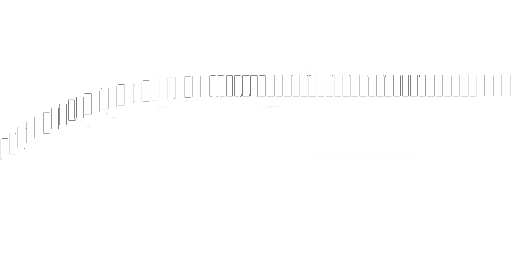

# Dash

Having a steering wheel that moves is nice, seeing the speed you're going at is better. Making a dash is probably the part that needs the most research. As such, I will only give you an introduction to making a simple dash so that you have a basic understanding of how it works. If you want a more complex dash, you can check how the dash of other cars are done and what they use.


The main component is the digital\_instrument.ini file, this is what will tell you what are the informations displayed in the dash. It will also take control of the LEDs on your car.

In the car, it will either be empties or coordinated from the origin of the object selected that will tells Assetto where to display the information on the dash. \
\
Let's look for example at the F458 Challenge dash.


<figure><figcaption></figcaption></figure>

This is an object to which texture is applied to is the design of the F458 dash. This can be done in paint photoshop or whatever tool you use. Once you have your dash background set on the object of your choice, you can either leave it like that and use coordinates in the digital instrument to place the information of your choice, or use empties. \
\
<br>

### 1 Using the object as parent

For the first option, we will use the orange dot as the origin. We can see that the Speed position is at the left bottom of the origin. So you will use a positive value for the X axis, the same value but negative for the Y axis so that it gets at the bottom of the dash. And a very small negative value in the Z axis to make the gear number pop out of the dash object.

Why do we do that? Because this is the world we are evolving in

<figure><figcaption></figcaption></figure>

In the end this is what you have in the digital\_instrument.ini about the Speed information

```
[ITEM_2]
PARENT=HUD
POSITION=0.031, -0.031, -0.002
TYPE=SPEED
SIZE=0.013
COLOR=255,255,255,255
INTENSITY=3
FONT=digital_big
ALIGN=CENTER

```

PARENT is the object we are talking about, the dash object in this case is called HUD.\
Position is the X Y Z coordinates of the information.

TYPE= is the information displayed.

SIZE = is the size of the information displayed, you can make it smaller or bigger depending on how it fits your dash.

INTENSITY = is the brightness of the information displayed

FONT = is the font used to display the information. You can find them all in content font


Another thing to consider while making a dash is dynamic information such as the RPM Graph. Let's look at how it's built

```
[ITEM_1]
PARENT=HUD
POSITION=0.0775, -0.0305, -0.002
TYPE=RPM_GRAPH
WIDTH=0.16
HEIGHT=0.076
TEXTURE_BASE=display_off.png
TEXTURE_TOP=display.png
COLOR=255,255,255,255
INTENSITY=3
RPM_MIN=1000
RPM_MAX=10200

```

Based on the RPM, it will fill the graph. This is done by inputting two texture files. How the RPM looks when the RPM is at the minimum level, and how it should look when it's at the maximum.

<figure><figcaption><p>this is the Display.png which is the RPM graph filled in white</p></figcaption></figure>

Then Assetto will gradually fill the png texture from left to right based on the RPM


Building the digital instrument that way you will be able to have a fully working dash like this

<figure><figcaption><p>vroom</p></figcaption></figure>

### 2 Using empties as parent

You can use empties to place the information you want on your steering wheel which is what I use for the V8 cars era which has a simple dash

<figure><figcaption></figcaption></figure>

You create an empty for the information want and put its center to the location where you want it to be. And you parent the empty to the STEER\_HR so that it turns alongside the steering wheel.


Be sure of the orientation of the empty, the Y axis must be pointed toward the sky

<figure><figcaption></figcaption></figure>

then in the digital\_instrument.ini you make small adjustments to the position to make it perfect

```
[ITEM_2]

PARENT=DISPLAY_FUEL
POSITION=-0.016,-0.006,-0.0

   ///(x,y,z) x-/rightt;  z+/forward
TYPE=FUEL
SIZE=0.012
COLOR=255,0,0
INTENSITY=4.5
FONT=digital_big

VERSION=2

ALIGN=RIGHT

```

You can change the color with the RGB values in COLOR.

<figure><figcaption></figcaption></figure>

### 3 Using LEDs

You can use LEDs on your steering wheel which is probably the easiest, just state the name of the object of the LED, starting at which RPM level it should activate, and its color

&#x20;

```
[LED_14]

OBJECT_NAME=LED_15
RPM_SWITCH=17500
EMISSIVE=0,0,255
DIFFUSE=0.5

BLINK_SWITCH=18000

BLINK_HZ=3

```

RPM SWITCH being the RPM level at which the LEDs activate, EMISSIVE is the color, DIFFUSE is the brightness and BLINK\_SWITCH is the RPM level at which the led should blink (usually the highest RPM) As well as the speed of the blinking in BLINK\_HZ.


If you want more features in your dash, do the same thing as we did now. Open the car, and check the parent and what's written in the digital instrument. Try to understand all the parameters used.
