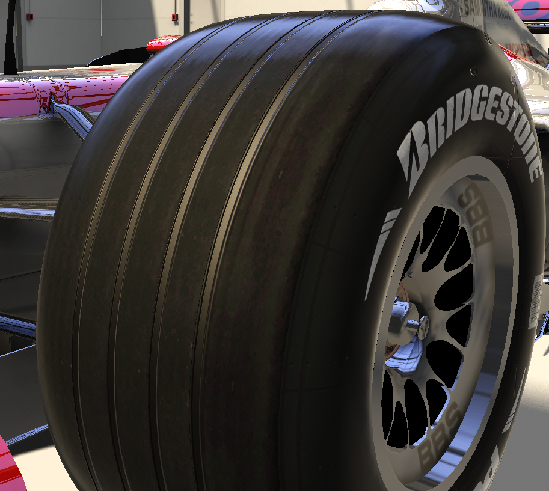

# The CTDP Conversion

## The premises

CTDP 2006 was one (if not THE) of the most played mod on rfactor. Back then in High School I had a laptop given by the school and which had an intel celeron and intel graphic card. Nothing that could run F1 games or Assetto Corsa at the time in 2015. And at the time F1 2013 with the classic content was doing highlights and I could just watch it from afar. I had a PSP with F1 06, and F1 Formula Championship Edition was only on the PS3 so I could only watch it from youtube videos. And then a video very very similar was on my feed. With the same high FOV camera than Formula Championship edition.&#x20;



This video was phenomenal I looked at it and was amazed at how good it looked and the HUD and all was just like formula championship edition. So I installed rFactor, Installed the mod, booted up. And magic came out of the screen. I was amazed that I could chose the Renault, and select any aero config the car had. I could switch between not nose winglet, the 2 version, the 4 version, changing the skins to the Canada or France one. And for the Ferrari I could have massa wear his green brazilian suits with the Canada version of the car with the podwing. The combinations were endless, I could watch any onboard on youtube no matter the race and recreate them perfectly in game. So even if I didn't have a PS3 or a good PC, I could still enjoy F1 racing. And even better than official F1 games. After a few years, I could finally get a much better PC (i7 4th gen, intel hd 4400 graphics 8GB ram. The specs of my life) and I could run Assetto Corsa and rFactor 2 as hotlapping sims (any more and there's a fire in my house). So naturally, what I wantd to know is what kind of F1 mods were available at the time. On rFactor 2, I was very happy to see that there was a thread about a port of CTDP in rFactor 2. I had a lot of hopes, the pictures showed a lot of WIP and ingame actions but eventually the guy doing the port vanished from the internet. On Assetto Corsa it wasn't very bright either. At first we had F1SR who were working on converting the cars, I still remember the video on Qazdar Karim youtube channel that showed the Ferrari and Renault, and had lot of hopes. They had converted the cars, made great sounds and even converted the CTDP helmets. But unfortunately, only the ferrari was released and then F1SR disbanded and the project was stopped. Then we had MSF that announced that they will rework the CTDP mod, improve assets and do a full modern release of the mod. And then ACFL claimed the same. In the end there was some drama around it, and MSF halted their work, ACFL released theirs but it wasn't up to standard. The sound engine was not good, physics was mid and there was no continuous update to address these issues.  So I lost hope, I was convinced that there was a curse on this mod. The fact that this was the best mod created for a sim product was the product of a devil contract where the counterparts was that anyone who dared trying to free this mod from the chains of rFactor 1 would vanish. \
\
Fast forward 2025, I started modding in 2021 to bring the cars I wanted to race in Assetto Corsa, and covered (nearly) the whole spectrum of the V8 era. 2007-2008 and 2010-2013. People repeatidly asked me to do a 2006 season mod, but at the time I said "never". Not because I didn't want it, or was fearing to touch this devil contract product. But because knowing myself and the love I have for this mod, the task would be huge and there was already the ACFL mod, that TheRaceProject reworked in the meantime, I just didn't feel ready and motivated enough to produce something I would be proud of. \
Well I still throw a bottle in the sea in 2024 by sending an email to CTDP. But frankly I just did that as a "joke" I didn't really expect CTDP to answer back. (Spoiler, they actually did but somehow their answer was blocked by gmail gateway so it never appeared in my mailbox)

<figure><figcaption></figcaption></figure>

\
But in 2025, there was still drama about it. And it reached the peak point the day I logged on discord and saw people on one of the Assetto server I was mainly active in dissing TheRaceProject  work. I log on Gtplanet, and the same thing happened. With TheRaceProject defending himself and people pointing out the flaws of his mods. So I snapped.

<figure><figcaption></figcaption></figure>

## The conversion

### The decision making

Converting the best mod of rFactor meant that this wasn't your average conversion. Put cars on track, drive them and select another car. The kind of mod you boot once in a while to recreate a specific pole lap from 2006 for a youtube video. I wanted it to have the same "WoW" effect when you download it, run it, and hear it as if it was 2010 all over again. I wanted it to make people fall in love again with 2006 cars. And since there was already 2 version of CTDP mod in AC already, it had to be different, so much that people wouldn't consider it as "yet another CTDP conversion".\
\
So how do we achieve that? What is the plan?\
\
First and foremost, Nostalgia will be a big factor. Since CTDP was a legendary mod, everyone knows about it and almost everyone once played it. Second, when you also compete with cars from VRC and RSS (albeit the later did no V8 groved mods) the cars needs to look good from onboard view, and the engine sound must be an experience that makes you want to put headphones and drive hundreds of laps just to hear it.  But how do we achieve that? The sounds were taken care of fisherman for the Ferrari Renault and Mclaren. He did the engine sounds for my 2008 mod and they were highly praised by the community for the eargasme. So it was a no brainer move to get him back doing these sounds. The other cars had engine sounds from Prophetimus that was released before, that were already good but the external audio was reworked to match up fisherman external audio. Like that we could merge the 2 sounds from 2 different audio guy without having a clear quality difference when hearing replay. The transition had to be seamless between cars that used fisherman audio, and cars that used Prophetimus audio.\
\
But what about the 1st? How do we bring back the nostalgia? The "WoW" effect that came from the CTDP mod was mainly from the fact that it was the most complete F1 mod ever created, every race setup was there, every skin was there, every aero change was there. It wasn't just an F1 mod, it was a virtual museum of the 2006 season, the place that documented the best every engineering piece of the 2006 story. This was the driving idea around this mod. And thankfully, I gathered around someone who shared the same idea than I. GIL.&#x20;

### Converting every aero changes

Before hopping on the idea of doing this, I first had to check if it was even possible to do that. The way it worked in rFactor, is that every 3D pieces were exported as a single .gmt file. Then the config file loaded each body part. Cars were modular by default, so it was just a matter of doing legos. Assetto Corsa worked differently, you assemble the car in one piece, and export it in one single file (the .kn5) and it load the whole car at once. At least vanilla Assetto Corsa. CSP adds a feature that allows modders to import objects in game, using the model replacement feature. It works by exporting the object in question, having the possibility of hiding an object of the car in game by naming it in the config. And selecting where it should be dropped. This feature was used by people to swap objects, wings change the driver model. But I never yet saw an example of this feature used on a wide scale as having to build an entire car using this feature just like how rFactor worked. So I first did a test with the Mclaren. I exported all the rear/front wings and body parts as individual parts. While it worked for the Mclaren, it highlighted a challenge that needed to be adressed. The AO map.\
\
The AO map is responsible for simulating shadows on the car itself. It is an important part of how good a car look in game. The issue I was facing is that the way CTDP worked with that technique of lego construction, is that the textures are shared. That includes the AO map. And since it had to accomodate the fact that there was X combinaison of aero look, and X skins that can be used independantly (meaning I could load the Renault Turkey skin with the brazil aero spec) there was no way of forcing the shadow on the skin file according to which aero spec would be loaded. If the Brazil spec had pod wings, they couldn't force that shadow around that area on the brazil skin because if the user chose the Australian aero config, there would be no podwing, and it would look weird to have shadows in that area. So the CTDP AO map texture was just every piece that is mapped on the skin mapping at once enlighted, and the general tone was greyish. Not ideal to reuse because while it works, it doesn't create located shadows depending on if there's a pod wing or not. It was a decent idea for rFactor, but for Assetto Corsa it's more noticeable, especially since people love taking pictures of cars in game. And that Assetto Corsa is 50% simracing 50% showroom. \
.png>).png>)\
\
Comparaison between CTDP AO map, vs the one I use in AC\
\
So what is the solution then? \
\
Double the work.\
\
I first assemble the whole car race spec by race spec in Blender, export it, create AO map, export the diffuse and ao texture into the race skin folder. Then I go back in blender, delete everything, only keep the specific aero spec parts of that race. Export it and save it as 1australia.kn5, and repeat the operation for every race spec that is different than the one before. So essentially, I assembled 2 times  the car in blender, multiplied by the number of different race spec. I think the max I had was 10 variations, so that makes 20 exports for one car.

<figure><figcaption>
The 1country.kn5 that get imported in game if you select the country race skin.
</figcaption></figure>

And to easily replace parts of the car with the CSP object replacement, when building the car I had to make it "modular". Meaning making the object tree look like blocks where part of the cars were parented to empties for an easy selection of mulitple objects. All front wing objects were parented to the empty front. So I just had to tell the game to hide the Front empty, and all the object parented to it would get hidden at the same time. Making the config look clean instead of having to name every object that would take 3 lines.&#x20;

<figure><figcaption></figcaption></figure>

In the end, what remains is the skeleton of the car, the tyres/rim/brakes, and the suspensions/cockpit/steering wheel. The rest are parented to empties for better object management.

\
Which is fine for cars like Redbull that didn't change much over the season, nightmare for cars like superaguri that basically produced 2 different cars over the whole season SA05 and SA06. Meaning that they not only changed the front wing, rear wing but also the main body of the car, the mirrors, the suspension. Totalling over 10 different versions of the car. Toyota was the same. Honestly at that time I wanted to quit because that work around dragged the work for soooo long.&#x20;

<figure><figcaption>
the memes that came out during that period were legendary though
</figcaption></figure>

The fact that suspensions also had to be changed on some cars, meant that for animating the suspension in game it was not possible to rely on ksanim either because that method implies to record in blender the 3D object moving, and that animation will expect that specific object in game. If I swap the suspension object, I have to produce another .ksanim file for animating that specific object, which I'm not even sure I can load to replace the previous suspension animation with CSP. Too much complexity so I relied on the \_DIR method. Which is a simple concept : The object is parented to an empty which will we name "SUSP1", and that empty will have its X axis following the center point of the DIR\_SUSP1. I place that center point on the brake duct and parent it to the SUSP\_LF empty. That way in game the center of that empty moves along SUSP\_LF when the wheel goes up and down, and so will the X axis of the SUSP1 empty, and since the suspension is parented to that empty, it will move too. And with CSP object replacement, I can specify that the object I want to import, will be parented to SUSP1. This essentially made the suspension move in game regardless of what I import in game.

<figure><figcaption></figcaption></figure>

Once the baseline of the work was defined, it was now a matter of knowing how to assemble the pieces of the puzzle. The config files of each CTDP cars gave us the list of parts that were loaded through every races. With the help of ChatGPT to summarize this wall of text, I had a first list of what pieces I needed to gather for each race spec. Then it was a matter of confirming with Gettsy pictures if what we assembled was correct. Which for some cars like renault and williams were a bit more complex than that. As they ran different configurations through free practice and races, and CTDP didn't always took the spec from the race.&#x20;

<figure><figcaption></figcaption></figure>

<figure><figcaption></figcaption></figure>

After back and forth making sure that every race spec was correct, we also noticed that some changes were not present in CTDP. Mainly the Ferrari and Renault who used to have in some races a "chimney" (don't know how to call it) which I understand why CTDP didn't put it in their cars as it was not consistent accross all the different body spec. It sometimes existed in the Australia body spec for the ferrari, sometime in the Brasil spec. \
.png>).png>)

These were added in the V2 alongside a significant rework of the car shape. Once everything was assembled and organized, the matter of generating a preview for the cars so that people can see in the preview how the car would look with the livery they choosed had a limitation in the vanilla way. Since I used the CSP replacement object heavily, the vanilla method would not work. Since the way it works is that it takes AC rendering and load the main .kn5 to generate the preview. So not only it would not reflect the different race spec look, but since some cars like the super aguri brought a different mapping when using the second body, the skin would look distorted in the preview. And I'm not manually creating previews by swapping each time the kn5 it loads with the fully assembled race spec version of the car. Fortunately Content Manager had the option to use CSP to render the previews, which would allow full CSP features such as the CSP replacement object feature to work for the rendering. Like that I just needed to press the create the preview, and it would automatically assemble the puzzle for each skin folder to have the whole car to do the preview.&#x20;

### The stalking

While the work progressed, I still needed to get permission for the release of the mod. And since I didn't get an answer from the website contact form, I wanted to try other means to contact CTDP. I first noticed that the sketchfab account was active but didn't post anything since 2 years. So went full OSINT mode. \
I contacted someone who worked with them in the past who gave me an email, which I contacted but still no answer. Then went into seeking the names of the people who worked at CTDP, and try to contact them personally. Found Daniel Linkedin profile and better yet, the website of Dahie which had a mastodon account linked to it, and which he seems to use daily. Perfect, let's create an account and contact him. The rest is history

<figure><figcaption></figcaption></figure>

Dahie was a great help in giving me infos and details about the cars CTDP created, as well as providing me PSD templates to advance further on some cars. Even some pointers into how the shader of the Renault should look like. Even gave me insights on some development choices like the rim being not fully 3D, using texture and alpha to make it look like a 3D rim, and other aspect of the car. I was like a kid in a meet your hero event.&#x20;

### The skins

This was entirely on GIL, he began his work on TheRaceProject mod but didn't quite finish yet and he had built a full document of how each cars looked at each race. And we went through it. CTDP had a decent base that we used, there was a question mark about what we do about the helmets, as we had the choice to use the modern ACSPRH helmets but didn't reflect the old look of these helmets as they were in 2006, or convert the CTDP helmets. Props to them the CTDP helmets were made with such accuracy and detail that they looked fine in AC when converted. It also allowed us to reuse the CTDP skins saving time. The only question mark was the Schubert helmet model that I didn't find it suitable in 2025. The top airbox part of the helmet was way too small compared to the real helmet, and since Kunos also had the Schubert helmet in AC, the comparaison was not so forgiving toward CTDP helmet as using the Kunos helmet would have been more faithfull. But I still didn't like the Kunos helmet shape as well as the "low poly" mapping of the white stripe on massa helmet that made it look more square than circular. DaiMon, a 3D designer had made the Schubert helmet back in rFactor days and used in multiple mods, and that helmet was converted before in AC so it became obvious that this was going to be the more accurate option we had at the time. And so GIL made skins for that helmet. &#x20;

<figure><figcaption></figcaption></figure>

During the conversion of CTDP helmet, the choice was made to adjust the mapping of the helmet to accept only one 1024x2048 texture, CTDP had for memory optimization purpose included both team drivers helmet skin in one file. Which was good because their drivers shared the same helmet model. As some drivers would have different helmets models in the same team it would have been a waste of memory to have a texture having 2 helmet drivers. And less manageable if someone wanted to create a specific helmet texture for one driver. So we cut every helmet skin in half to separate the drivers, and so each drivers have one single texture of 1024x2048. \
\
CTDP also made the choice of having only 2 drivers per teams. That meant like drivers like Montagny, Montoya, Scott speed did not exist. So we had to cover these drivers as well and include them. We also included some slight variation of the helmets that occured during the season like toro rosso, and I also found out that Fisichella brought a helmet during the French GP celebrating Italy winning the world cup against... France. Not so happy about this discovery and it was at this moment that I realized that Fisichella was a mid driver. Gloves also had some special attention, we tried to replicate every glove variation that happened over the course of the season and the differences between drivers from the same team such as DelaRosa and Montoya gloves being different

<figure><figcaption></figcaption></figure>

And of course, Massa has his green Brazil flag themed driver suit. Which was a must have for me I love that suit. Another interesting pieces were the test liveries, the ones teams used in pre season to have even more fidelity. The most interesting one were the Mclaren who had an orange tone and drivers using their 2005 helmet skin.

<figure><figcaption>
Mclaren 2006 pre season orange livery and Montoya helmet, having the 2005 look
</figcaption></figure>

The pit crew also had the same attention given to as we made sure that their suits matched the race selected. From the tobacco/non tobacco for the Ferrari, to the one off Honda blue and yellow skin in China, everything matchs up to not break the immersion.

<figure><figcaption></figcaption></figure>

### Optimizing and Improvements

The car body is easy to work with, but other aspects of the car less noticeable also needed some touch up. For example, the suspensions are often mapped with the skin file of the car, or the wcextra1 texture. This means that even though the car had a 2K size, since the suspension was mapped to it the look was kind of blurry, and in order to have clear looking suspensions, 8K textures would be needed.\
\
Instead, I have remapped the suspension and also cut it into two parts. Carbon and Chrome (or Aluminium idk). The carbon part would have a carbon texture that weights 200ko, multiplied by 500 which gives it a sharp look. As for the chrome, a silver texture as well as some CSP shaders makes it look reflective.  

<figure><figcaption>
Honda suspension in real life
</figcaption></figure>

<figure><figcaption>
Using CTDP original suspension and texture
</figcaption></figure>

<figure><figcaption>
Using the explained method (chrome isn't as  reflective in game)
</figcaption></figure>

The original CTDP tyres look well in rFactor, but didn't age well. Bringing the tyres made for the 2008 mod made a whole difference in the look of the car, crazy how detailed tyre model does to a 16 year old F1 model.&#x20;

<figure><figcaption></figcaption></figure>

The car has 2 tyre model inside the .kn5, a groved one and a slick one&#x20;

<figure><figcaption></figcaption></figure>

The reason behind this is simplicity and also better to the eyes. Why? Because the Groved tyres does not concern itself with the matter of "blurring" when spinning at high speed. Wheareas if the inters and Wet were fully modelled in 3D, when spinning at high speed the effect would look odd as Assetto Corsa is not very clever with "blurring" the tread at high speed. So it just look like a static tread going fast. The slick tyre we can produce a "inters" and "wet" tyre look just with textures and normal map. Grooved too but it looks better with 3D grooves than just simulations through normal map.&#x20;

<figure><figcaption>
Blurred
</figcaption></figure>

<figure><figcaption>
not blurred
</figcaption></figure>

Ignacy also came accross an odd looking Michelin tyre, a mix between wet and slick tyres. And just like for the 2008 mod where we added slick compound as an extra, we also added it to the mod as an extra compound

&#x20;

<figure><figcaption></figcaption></figure>

As seen with Kunos, normally you chose between a grooved 3D tyre model like they did for the F2004 if you only concern yourself with dry tyres, or a slick tyre with groove and wet tread simulated through normal map in Assetto Corsa EVO for the same F2004. Thankfully, CSP has a neat feature that allows us to select which 3D object is displayed in game depending on the compound selected. So if you chose the dry tyres, it will show the 3D grooved tyre. If you chose inters/wet, it will show the slick tyres, on which it will apply the wet textures.

Looking inside the tyre, we saw an area of improvement : the brakes. CTDP had the brake and disc fully embedded in the calliper. Instead we wanted something a little more "dynamic" and fully detached from the calliper. So for each brake, I have removed the part through face deletion to remove the brakes and discs. And then used the brake and disc I used for the 2008 mod. This allowed for the disc to actually spin, and also glow using AC disc shader, while having the calliper separated and which I can remap the UV to use the carbon trick I used for the suspension. Resulting in a better looking calliper from onboard view, and better disc/brake from the external POV.&#x20;

<figure><figcaption>
My brake disc and pad
</figcaption></figure>

<figure><figcaption>
CTDP base brake disc and pad
</figcaption></figure>

Lastly on the topic of optimization, space and lods. Converting all the aero specs meant that the total space usage would be high and I'm not rich either, I run a small 500GB external hard drive on which it remained 8GB. So I can't invest myself into eating space as if we don't live in the RAM apocalypse world. This meant for example that to save space, I exported the "addons" (understand each car race spec .kn5 as seen before) without textures.&#x20;

<figure><figcaption></figcaption></figure>

Like that, it pulls textures from the main .kn5, which act as a shared resources on which anything imported can access the texture from. And so, carbon, normal map, chrome, and all other shared textures didn't need to be bundled inside the addon .kn5 making its weight reduced (and since there is 10 variations on some cars, we don't need 10 times the same texture inside the .kn5 when it can be accessed from the main .kn5). Unfortunately, this does not apply for the AO map. I could have imported them into the main .kn5 by creating 2 or 3 objects size 0.001 inside the main .kn5, and assign it a shader that accepts 6 textures slot, and fill them with all the AO texture and diffuse textures needed for the different body/front/rear/wing but it would have been more complex than just including them inside each skin file. The space saved with this technique was not worth the compromise of easy editing of the AO/diffuse texture by just accessing the texture inside the skin folder. So each skin folder contains the livery of the race spec, but also the AO and diffuse texture associated. Textures used 2K size for the skin as it was enough for having clear looking bodies and sharp logo. The driver names were still a little blurry if looked from close up but from 3-4 feet away it looked fine. I also used the DXT5 compression for the .dds file as it's the common compression method for AC, boasting good space saving with great looking textures.&#x20;

As for Lods, the most expensive object in the main .kn5 is the tyres. As most round objects, to achieve a good looking round tyre without having the feeling of "low poly" (and especially for the grooved model) the tyres needed lot of triangles. Fortunately, CTDP being decades old model made for weaker PC, we have a free budget for triangles. Kunos pipeline advise LOD A to have around 150k-300k triangles, so we could improve the tyres shape and get the LOD A of cars reaching 120k triangles. Then in LOD B we use a lesser quality version for the tyres while still retaining the LOD A car which bring the triangle count down to 50k, so well within the LOD B/LOD C triangle budget Kunos recommended.&#x20;

<figure><figcaption>
The lod B tyre
</figcaption></figure>

<figure><figcaption>
The LOD A tyre
</figcaption></figure>

This also makes it a lot much better as players won't notice anything when the game engine switchs from LOD A/B/C, and in fact, since the LOD B is well within LOD C budget. So LOD B is also used as LOD C, the only difference aside tyres is the lack of steering wheel leds and dash, so that there is no computational power lost trying to animate these on the AI cars. This is also very good for the sake of the race spec versions. As I don't need to provide lods of each race spec .kn5 to fit in LOD B/C, so the config will also swap objects with a single .kn5 on all 3 LOD A/B/C, making it a lot more manageable.

LOD D however isn't the same story, since it's the far away lod. Building the LOD D with the lowest LOD object from the main CTDP mod, as well as decimated tyres. But on the matter of race specs, since the LOD D is not "noticeable", only the major race spec changes gets a lod version. For example the Super Aguri which SA06 changes the mapping, I also had to provide a lod D version of that race spec.

<figure><figcaption></figcaption></figure>

All objects with the same material were merged in a single objects, making it goes from 120 objects in LOD B to 25 objects in LOD D, as well as 50k to 5k triangles. So well withing the 5k-20k range recommanded by Kunos. I'll have to thank zsolt\_mol for forcing me to study LOD optimisation when I released the 2007 MMG conversion, and making changes and benchmark so that league racing with the cars reached the highest fps possible. This mod also was optimized in that regard.&#x20;

### Dash screen

You might wonder why only the Ferrari have a interactif dash and not the other cars? Well firstly it's because there is almost zero information about the other teams dash. You can't see anything on the onboard view, and the other cars are not popular enough to get modern youtube video where we see the dash because some no name rich guy managed to get access to that F1 car and put a go pro on his helmet. Unless, we are talking about Ferrari.\
\
INSERT D3RZA blablablabla

For other teams we had 3 choices.&#x20;

* Copy the CTDP dash from rFactor : This is what ACFL did, TheRaceProject too. So I wanted it to be different
* Try to copy the Formula Championship edition dash : Unfortunately the details are too small on screen to notice all the informations displayed, but it's still on the back of my head and one day it will be done.
* 90 pixels onboard view and guessing (and taking references from other modders in AC/GP4, or the steering wheel composition)&#x20;

For V1 release, 3rd option was picked. Why? Because I managed to find two pictures essentially. 

<figure><figcaption>
One of the rare moment an onboard view shows something meaningful
</figcaption></figure>

<figure><figcaption></figcaption></figure>

<figure><figcaption>
Redbull steering wheel
</figcaption></figure>

I always wondered if the dash background should have been black, or more grey like a calculator display, but based on the informations available and especially that honda onboard, I settled for a black background and red led informations. Other teams steering wheels seemed to have the same composition. Redbull I was considering having a grey backlight because the display gave me huge calculator display vibe, but the fact that the RPM on top is red digits on a black background made me use a black background instead for the sake of consistency.

### Updating the Renault and Ferrari (V2 update)

I loved the R26 and the F248 as they are easily my favorite 2000-2006 cars era (the era of the white and red ferrari, and the blue and yellow renault). And while the CTDP cars were very close to the real deal, there were some details that I wanted to change to make it look more like onboard view.

For the Renault the issue was that the nose toward the sides had curves, making it look like the nose isn't like a square box but rather a curved one. Essentially, from the cockpit view, the nose was flat. And if we take the codemaster R26 as a reference, we can easily see the difference

<figure><figcaption>
CTDP R26
</figcaption></figure>

<figure><figcaption>
Codemaster R26
</figcaption></figure>

Another point was that there was a elevation change around the cockpit area, that is present on the real life R26 and also a little on the codemaster R26

<figure><figcaption></figcaption></figure>

<figure><figcaption>
Codemaster R26
</figcaption></figure>

<figure><figcaption>
CTDP R26
</figcaption></figure>

Replicating these changes made the R26 go from this to this, which is a lot closer to the onboard view

<figure><figcaption></figcaption></figure>

<figure><figcaption></figcaption></figure>

<figure><figcaption></figcaption></figure>
